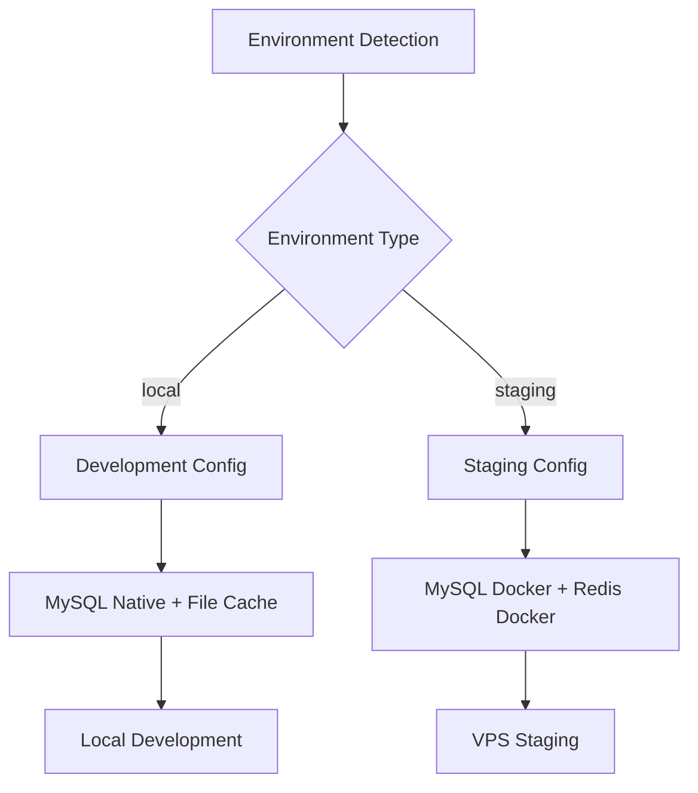

# Design Document

## Overview

Este documento descreve o design da arquitetura de ambientes para o sistema de Controle Financeiro, estabelecendo uma estrutura clara para desenvolvimento local nativo e staging no VPS usando Docker.

## Architecture

### Environment Structure

```
┌─────────────────┐    ┌─────────────────┐
│   DEVELOPMENT   │    │     STAGING     │
│  (Local Native) │───▶│  (VPS Docker)   │
│   NO DOCKER!    │    │  DOCKER ONLY!   │
└─────────────────┘    └─────────────────┘
│                      │
│ • PHP 8.3+ Native    │ • PHP Docker
│ • MySQL Native       │ • MySQL Docker
│ • File Cache         │ • Redis Docker
│ • Local Files        │ • Docker Volumes
│ • Debug ON           │ • Debug Limited
│ • Hot Reload         │ • Optimized Build
│ • Artisan Serve      │ • Nginx + PHP-FPM
│ • MAMP/XAMPP/Herd    │ • Containerized
│ • Composer Local     │ • Docker Compose
│ • SQLite Tests       │ • MySQL Tests
│ • Xdebug Native      │ • Logs Estruturados
│ • MailHog Native     │ • SSL/HTTPS
│ • Zero Containers    │ • Health Checks
└──────────────────────┴──────────────────────

IMPORTANTE: Docker é PROIBIDO para desenvolvimento local!
Desenvolvimento = 100% nativo, Staging = 100% Docker
```

### Configuration Management



## Components and Interfaces

### 1. Environment Configuration Manager

**Purpose**: Detect and configure environment-specific settings

**Interface**:
```php
interface EnvironmentConfigInterface
{
    public function detectEnvironment(): string;
    public function loadConfiguration(string $environment): array;
    public function validateConfiguration(): bool;
}
```

**Implementation**:
- Environment detection via `APP_ENV` variable
- Fallback detection via hostname/domain patterns
- Configuration validation and error handling

### 2. Database Configuration Handler

**Purpose**: Manage database connections per environment

**Configurations**:

**Development (Local Native)**:
```php
'default' => env('DB_CONNECTION', 'mysql'),
'connections' => [
    'mysql' => [
        'driver' => 'mysql',
        'host' => env('DB_HOST', '127.0.0.1'),
        'port' => env('DB_PORT', '3306'),
        'database' => env('DB_DATABASE', 'controle_financeiro_local'),
        'username' => env('DB_USERNAME', 'root'),
        'password' => env('DB_PASSWORD', ''),
        // Native MySQL via MAMP/XAMPP/Homebrew
    ],
    'sqlite_testing' => [
        'driver' => 'sqlite',
        'database' => ':memory:',
        // For fast testing only
    ]
]
```

**Staging (VPS)**:
```php
'default' => 'mysql',
'connections' => [
    'mysql' => [
        'driver' => 'mysql',
        'host' => env('DB_HOST', 'mysql'),
        'port' => env('DB_PORT', '3306'),
        'database' => env('DB_DATABASE', 'controle_financeiro_staging'),
        'options' => [
            PDO::MYSQL_ATTR_SSL_CA => env('MYSQL_ATTR_SSL_CA'),
        ],
    ]
]
```

### 3. Cache and Session Configuration

**Development**:
```php
'cache' => [
    'default' => 'file',
    'stores' => [
        'file' => [
            'driver' => 'file',
            'path' => storage_path('framework/cache/data'),
        ]
    ]
],
'session' => [
    'driver' => 'file',
]
```

**Staging**:
```php
'cache' => [
    'default' => 'redis',
    'stores' => [
        'redis' => [
            'driver' => 'redis',
            'connection' => 'cache',
        ]
    ]
],
'session' => [
    'driver' => 'redis',
    'connection' => 'session',
]
```

### 4. Docker Configuration Manager

**Purpose**: Provide Docker setup for staging environment only

**Local Development** (100% NATIVO - ZERO Docker):
- Native PHP 8.3+ via `php artisan serve` (porta 8000) ou Laravel Herd
- Native MySQL via MAMP/XAMPP/Homebrew/Laravel Herd (porta 3306)
- File-based cache and sessions para máxima velocidade de desenvolvimento
- Direct file system access para hot reload instantâneo sem overhead
- SQLite em memória APENAS para testes automatizados (PHPUnit)
- Composer install local para vendor/ nativo
- Xdebug nativo para debugging com IDEs
- Ferramentas auxiliares nativas opcionais (MailHog local, Redis local)
- ZERO containers, ZERO Docker Compose para desenvolvimento
- Configuração via .env.local para ambiente nativo
- Performance máxima sem overhead de virtualização
- REMOÇÃO COMPLETA de docker-compose.local.yml e scripts Docker para desenvolvimento
- REMOÇÃO COMPLETA de scripts/docker-dev.sh e configurações Docker de desenvolvimento
- Documentação clara: Docker é PROIBIDO para desenvolvimento local
- Limpeza de todas as referências Docker em documentação de desenvolvimento

**Staging Docker**:
- Optimized MySQL setup
- Redis for caching and sessions
- Nginx with SSL termination
- Health checks and monitoring
- Backup volumes


## Data Models

### Environment Configuration Model

```php
class EnvironmentConfig
{
    public string $environment;
    public array $database;
    public array $cache;
    public array $session;
    public array $queue;
    public array $logging;
    public array $security;
    public bool $debug;
    
    public function isLocal(): bool;
    public function isStaging(): bool;

    public function getDockerCompose(): string;
}
```

### Deployment Configuration

```php
class DeploymentConfig
{
    public string $sourceEnvironment;
    public string $targetEnvironment;
    public array $backupSettings;
    public array $migrationSettings;
    public array $rollbackSettings;
    
    public function createBackup(): bool;
    public function deploy(): bool;
    public function rollback(): bool;
    public function runSmokeTests(): bool;
}
```

## Error Handling

### Environment Detection Errors
- Fallback to safe defaults (staging-like settings)
- Log environment detection issues
- Provide clear error messages for configuration problems

### Database Connection Errors
- Retry logic for temporary connection issues
- Fallback database configurations
- Clear error messages for setup issues

### Docker Configuration Errors
- Automatic fallback to simplified Docker setup
- Resource requirement validation
- Clear troubleshooting guidance

## Testing Strategy

### Local Development Testing
```bash
# Unit tests with SQLite in-memory
php artisan test --env=testing

# Feature tests with local database
php artisan test --env=local

# Docker integration tests (optional)
./scripts/test-docker-local.sh
```

### Staging Testing
```bash
# Automated deployment tests
./scripts/deploy-staging.sh --test

# Smoke tests after deployment
./scripts/smoke-tests-staging.sh

# Performance tests
./scripts/performance-tests.sh staging
```

### Environment Configuration Tests
```php
class EnvironmentConfigTest extends TestCase
{
    public function test_detects_local_environment();
    public function test_detects_staging_environment();
    public function test_loads_correct_database_config();
    public function test_validates_configuration();
    public function test_fallback_to_safe_defaults();
}
```

## Deployment Workflow

### Local to Staging Deployment


### Rollback Process


## Security Considerations

### Environment Isolation
- Separate environment variables per environment
- No staging secrets in development
- Encrypted secrets in staging

### Database Security
- Different database users per environment
- SSL connections in staging
- Regular security updates

### Docker Security
- Non-root containers
- Minimal base images
- Regular image updates
- Secret management via Docker secrets

## Performance Optimizations

### Development
- Fast database (SQLite)
- File-based caching
- Hot reload enabled
- Minimal logging

### Staging
- Optimized performance
- Redis caching
- Optimized queries
- Performance monitoring
- CDN integration
- Load balancing preparation

## Monitoring and Logging

### Development
```php
'logging' => [
    'default' => 'stack',
    'channels' => [
        'stack' => [
            'driver' => 'stack',
            'channels' => ['single', 'stderr'],
        ],
    ],
],
```

### Staging
```php
'logging' => [
    'default' => 'stack',
    'channels' => [
        'stack' => [
            'driver' => 'stack',
            'channels' => ['daily', 'stderr'],
        ],
        'daily' => [
            'driver' => 'daily',
            'path' => storage_path('logs/laravel.log'),
            'level' => 'debug',
            'days' => 14,
        ],
    ],
],
```

## Documentation Structure

```
docs/
├── environments/
│   ├── local-setup.md
│   ├── staging-setup.md
│   └── troubleshooting.md
├── deployment/
│   ├── staging-deployment.md
│   ├── rollback-procedures.md
│   └── backup-restore.md
└── docker/
    ├── local-docker.md
    ├── staging-docker.md
    └── docker-troubleshooting.md
```